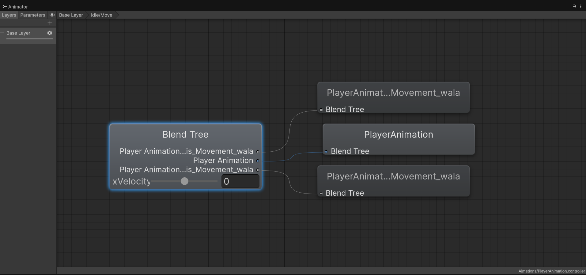
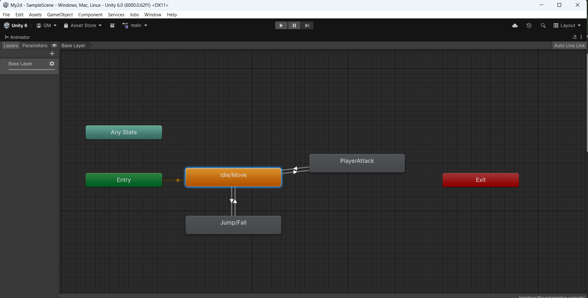

# Unity2D Combat System

This project is a 2D combat prototype built in Unity, focusing on clean architecture and correct gameplay logic rather than visuals.

## Demo Video

##Demo Images

## Features
- 2D player movement (left/right, jump, flip)
- Ground detection using Raycast2D
- Animation-driven melee attacks
- Hit detection using Physics2D.OverlapCircleAll
- Animation Events for precise attack timing
- Enemy damage feedback with timed color changes
- Gizmos for visual debugging of attack range and ground checks

## What I Learned
- Proper use of Animator and Animation Events
- Separating game logic from visual feedback
- Debugging common Unity issues (layers, colliders, Z-axis, null references)
- Writing safer and more maintainable Unity code

## Tech Stack
- Unity (6000.2.14f1)
- C#
- 2D Physics

## Status
🚧 Work in progress — this project is being expanded step by step to include health systems, knockback, and enemy AI.
