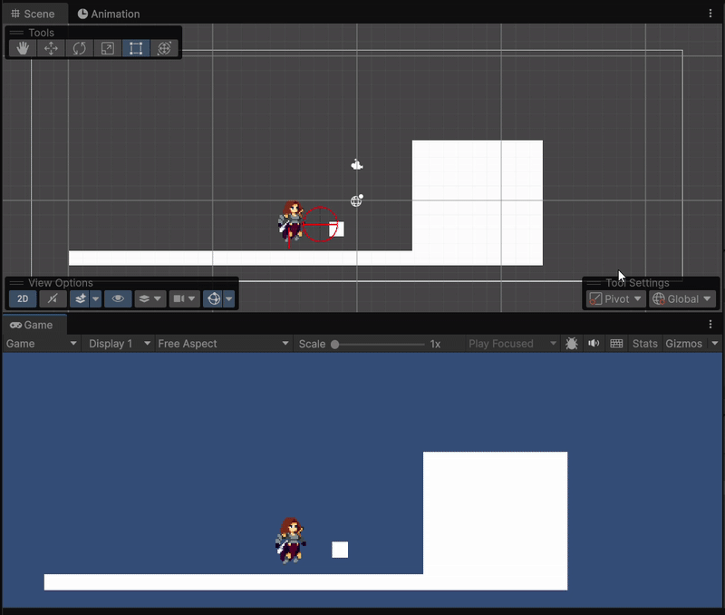

# Unity 2D Combat Prototype

A focused 2D side-scrolling combat & movement prototype built in Unity.  
The goal was clean code structure, proper animation timing, and solid core gameplay mechanics — visuals were never the priority.

## Demo Video and Images During Start of Project 

## Demo Video

<video src="Assets/README-Image/PlayThrough.mp4" controls muted playsinline width="800"></video>

*(If the embedded video doesn't play, open `Assets/README-Image/Demo.mp4` directly in your media player.)*

## Core Features

- Smooth 2D platformer movement (run left/right, variable jump height, sprite flip)  
- Reliable ground detection via `Physics2D.Raycast`  
- Animation-driven melee attack with precise hit timing  
- Area-of-effect hit detection using `Physics2D.OverlapCircleAll`  
- Animation Events for triggering damage at the correct frame  
- Visual enemy feedback (timed color flash on hit)  
- Editor gizmos for attack range, ground check ray, and debug visualization  

## Project Motivation

This was created as a deliberate practice project to:
- Deeply understand Unity's 2D animation system and event workflow  
- Build confidence with clean separation between input, logic, physics and visuals  
- Create reusable base character & combat patterns for future projects  
- Avoid "spaghetti code" habits common in early prototypes

## Key Code Highlights

Some patterns that turned out nicely:

- **BaseCharacter** abstract class handling shared movement, flip, ground check & knockback logic  
- Animation-event driven attack (no coroutine timing hacks)  
- Centralized gizmo drawing for quick debugging in editor  
- Safe null checks + early returns in critical paths  
- LayerMask usage for clean collision filtering  

These patterns were later reused and expanded in larger projects.

## Current Status

🚫 **Abandoned / Archived** — No longer actively developed (February 2026)

This prototype successfully served its purpose as a learning and systems-building exercise.  
Many of the movement, combat timing, and architecture ideas have been carried forward and significantly improved in other, more complete projects.

Feel free to:
- Study the code  
- Fork it  
- Use any patterns or snippets in your own work  

No support or updates will be provided going forward.

## License

MIT License  

You are free to use, modify, distribute, and sell anything built from this code — no attribution required (but appreciated if you want to mention the source).

See the [LICENSE](LICENSE) file for full details (or just add the standard MIT text below if you prefer).

---

Happy building!  
— MEHRA
